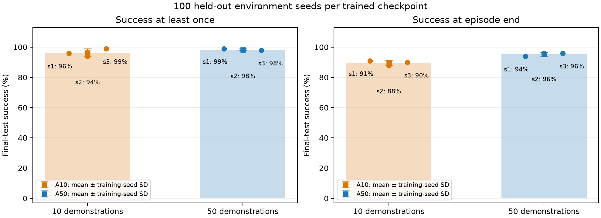
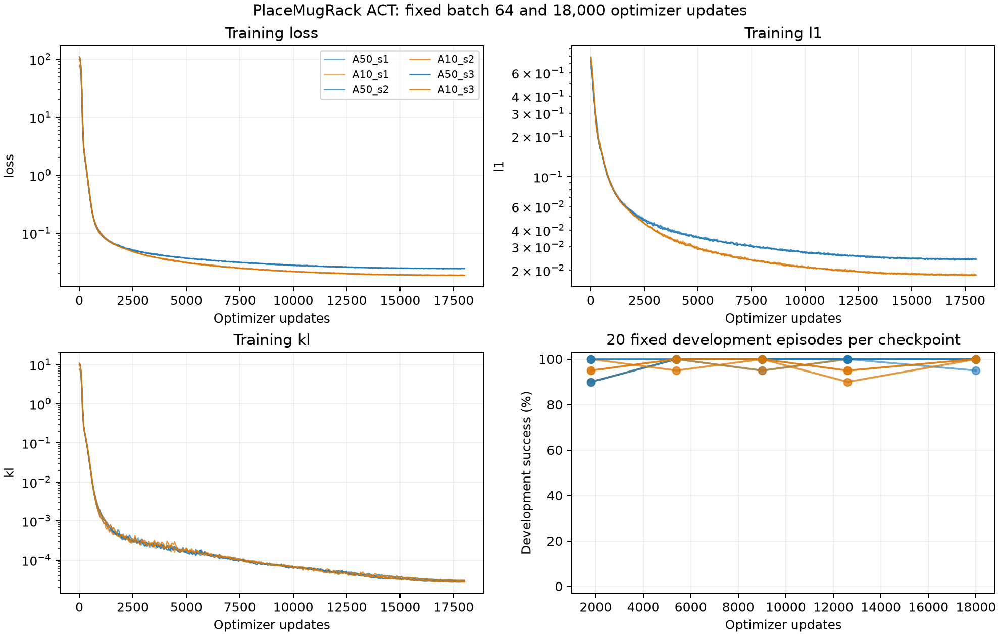

# PlaceMugRack：4090 实验执行结果

完成时间：2026-10-07 01:49 CST。状态：**六个训练 run、600 次开发评估和 600 次最终测试均已完成。**

执行依据：[06_4090_EXPERIMENT_DESIGN.md](06_4090_EXPERIMENT_DESIGN.md)。本次使用本地 ACT 训练结果；未修改上游核心 Python 源码。

## 1. 最终测试结果

每个训练 run 在相同的 100 个独立环境 seeds（2000–2099）上测试。checkpoint 在全部训练和开发评估完成后统一冻结，最终测试没有用于调参或重新选权重。

- **A10（10 条示范）**：曾成功率 **96.33% ± 2.52 个百分点**；结束时成功率 **89.67% ± 1.53 个百分点**。± 为三个训练 seed 的样本标准差。
- **A50（50 条示范）**：曾成功率 **98.33% ± 0.58 个百分点**；结束时成功率 **95.33% ± 1.15 个百分点**。± 为三个训练 seed 的样本标准差。

逐 run 结果：

- **A50_s1**：选中 step 5,400；最终曾成功 **99/100**、结束时成功 **94/100**；[逐 episode 结果](../experiments/act_placemugrack_study/runs/A50_s1/test/result.json)、所选权重（本机文件：`experiments/act_placemugrack_study/runs/A50_s1/checkpoints/best_model.pt`）。
- **A10_s1**：选中 step 12,600；最终曾成功 **96/100**、结束时成功 **91/100**；[逐 episode 结果](../experiments/act_placemugrack_study/runs/A10_s1/test/result.json)、所选权重（本机文件：`experiments/act_placemugrack_study/runs/A10_s1/checkpoints/best_model.pt`）。
- **A50_s2**：选中 step 12,600；最终曾成功 **98/100**、结束时成功 **96/100**；[逐 episode 结果](../experiments/act_placemugrack_study/runs/A50_s2/test/result.json)、所选权重（本机文件：`experiments/act_placemugrack_study/runs/A50_s2/checkpoints/best_model.pt`）。
- **A10_s2**：选中 step 18,000；最终曾成功 **94/100**、结束时成功 **88/100**；[逐 episode 结果](../experiments/act_placemugrack_study/runs/A10_s2/test/result.json)、所选权重（本机文件：`experiments/act_placemugrack_study/runs/A10_s2/checkpoints/best_model.pt`）。
- **A50_s3**：选中 step 5,400；最终曾成功 **98/100**、结束时成功 **96/100**；[逐 episode 结果](../experiments/act_placemugrack_study/runs/A50_s3/test/result.json)、所选权重（本机文件：`experiments/act_placemugrack_study/runs/A50_s3/checkpoints/best_model.pt`）。
- **A10_s3**：选中 step 5,400；最终曾成功 **99/100**、结束时成功 **90/100**；[逐 episode 结果](../experiments/act_placemugrack_study/runs/A10_s3/test/result.json)、所选权重（本机文件：`experiments/act_placemugrack_study/runs/A10_s3/checkpoints/best_model.pt`）。

配对训练 seed 的 A50−A10 曾成功率差值：+3.0, +4.0, -1.0 个百分点；平均差值 +2.00 个百分点。

结束时成功率的配对差值：+3.0, +8.0, +6.0 个百分点；平均差值 +5.67 个百分点。

**指标含义**：`success_once` 表示 500 步内曾满足官方成功条件；`success_at_end` 表示第 500 步仍满足。一次短暂成功后失去成功状态的轨迹不能称为稳定完成。

完整汇总：[results.json](../experiments/act_placemugrack_study/results.json)；失败阶段及配对结果：[failure_analysis.json](../experiments/act_placemugrack_study/failure_analysis.json)。

## 2. 失败阶段

下列分类互斥，每个条件合计 300 条 rollout。分类依据环境事件和最终指标；它们用于描述行为，不单独证明失败的因果机制。

- **A10**：结束时成功 269；曾成功但结束时不成功 20；未出现抓取 0；抓取后未抬升 0；抬升后未接触杯架 9；接触杯架但未达到成功条件 2。
- **A50**：结束时成功 286；曾成功但结束时不成功 9；未出现抓取 0；抓取后未抬升 0；抬升后未接触杯架 2；接触杯架但未达到成功条件 3。

主评估代表视频固定选择前两批第一个环境。最终测试中对应 seeds 2000、2004；开发评估中对应 1000、1004。完整录像位于各评估目录的 `videos/`，每段为 501 帧。

以下成功/失败示例优先引用已录制的最终测试视频；缺少对应类别时，使用同一 checkpoint、同一四环境 seed 批次补录，只有录像所在环境索引发生变化。补录在测试后按行为类别选择，仅用于说明，明确排除在主结果之外。

视频及复核索引：[video-examples.json](../experiments/act_placemugrack_study/video-examples.json)。

六段失败视频均为补录：额外重放 24 条 rollout（每批 4 个环境，只录其中 1 个），不计入主矩阵的 1,200 条或成功率。六条所选轨迹的初始状态、成功指标和阶段事件首次出现步数均与原测试完全一致；录像均为 501 帧。复查见 [补录审计](../experiments/act_placemugrack_study/checks/supplementary-audit.json)。

- **A50_s1**：稳定成功 seed 2000（本机文件：`experiments/act_placemugrack_study/runs/A50_s1/test/videos/0.mp4`）（原始测试录像）；未曾成功 seed 2034（本机文件：`experiments/act_placemugrack_study/supplementary_videos/A50_s1/failure_seed_2034/videos/0.mp4`）（补录）。
- **A10_s1**：稳定成功 seed 2000（本机文件：`experiments/act_placemugrack_study/runs/A10_s1/test/videos/0.mp4`）（原始测试录像）；未曾成功 seed 2006（本机文件：`experiments/act_placemugrack_study/supplementary_videos/A10_s1/failure_seed_2006/videos/0.mp4`）（补录）。
- **A50_s2**：稳定成功 seed 2000（本机文件：`experiments/act_placemugrack_study/runs/A50_s2/test/videos/0.mp4`）（原始测试录像）；未曾成功 seed 2029（本机文件：`experiments/act_placemugrack_study/supplementary_videos/A50_s2/failure_seed_2029/videos/0.mp4`）（补录）。
- **A10_s2**：稳定成功 seed 2000（本机文件：`experiments/act_placemugrack_study/runs/A10_s2/test/videos/0.mp4`）（原始测试录像）；未曾成功 seed 2007（本机文件：`experiments/act_placemugrack_study/supplementary_videos/A10_s2/failure_seed_2007/videos/0.mp4`）（补录）。
- **A50_s3**：稳定成功 seed 2000（本机文件：`experiments/act_placemugrack_study/runs/A50_s3/test/videos/0.mp4`）（原始测试录像）；未曾成功 seed 2019（本机文件：`experiments/act_placemugrack_study/supplementary_videos/A50_s3/failure_seed_2019/videos/0.mp4`）（补录）。
- **A10_s3**：稳定成功 seed 2000（本机文件：`experiments/act_placemugrack_study/runs/A10_s3/test/videos/0.mp4`）（原始测试录像）；未曾成功 seed 2082（本机文件：`experiments/act_placemugrack_study/supplementary_videos/A10_s3/failure_seed_2082/videos/0.mp4`）（补录）。

## 3. 实际训练与模型选择

- 任务：L0_TwoRobotPlaceMugRack-v1；A50 为全部 50 条/11,228 帧，A10 为固定 10 条/2,241 帧。
- 两个条件各训练 seed 1/2/3；相同 seed 的初始模型参数 hash 一致。
- 每 run：batch 64、18,000 次更新、1,152,000 个样本呈现；六个 run 合计 108,000 次更新。
- 等更新数意味着 A10 重复见到样本更多：按样本呈现量/原始帧数折算，A10 约 514.1 遍、A50 约 102.6 遍。本轮是固定计算预算的数据量对照，不是等 epoch 对照；实际 DataLoader 每遍 shuffle 并 drop_last。
- AdamW：主学习率 1e-4、backbone 命名参数组 1e-5，warmup 900 步，cosine；沿用官方 epoch 分支的 BF16 和分组梯度裁剪。
- 模型：ResNet18 + 冻结 DINOv2-L，ACT hidden 256、encoder 2 层、decoder 4 层、动作块 24 步；保持现有 decoder 输出索引。
- state/action q01/q99 分别仅从各条件自己的训练轨迹计算；训练与部署的 stats hash 一致。
- human_H57 episode 0 固定用于训练，episode 1 固定用于开发/最终测试，采样帧及缓存 hash 固定。
- 在 1,800/5,400/9,000/12,600/18,000 步各做 20 次开发评估；先按 success_once、再按 success_at_end、再按较早步数选择。
- 评估统一 physx_cpu、rt-fast、pd_joint_pos、4 个并行环境、500 步，light temporal aggregation 窗口 4；辅助 DTW/TSS 统一关闭。

训练 L1 使用各条件自己的归一化尺度，只作优化诊断；跨条件结论以闭环评估为主。

## 4. 4090 的实际利用

- 冻结配置为 batch 64、workers 8。500 步标定中，单训练约 1478 samples/s；双训练合计约 1753 samples/s，提升 18.6%。
- 先执行 A50 seed 1 试运行，再用两个 run 的队列并发；单次开发评估通过全局锁串行化，允许另一 run 继续训练。
- 正式队列从启动至最后一次测试完成共 **2.11 小时**，不含之前脚本实现和标定，也不含测试后的视频补录、图件和报告整理。
- 六个 run 的实测稳态更新耗时累计 **1.97 小时**；开发评估进程累计 **0.70 小时**，最终测试进程累计 **0.34 小时**（评估含模型/环境初始化，不含全局锁等待）。
- 按上述累计计时工作量，更新约占 **65.4%**、评估约占 **34.6%**。这是工作量占比：存在并发，且更新计时不含各 run 最初 50 步、保存与初始化，不能解释为总体墙钟时间的分割。
- 全队列按 1 秒采样的 GPU 利用率均值 **61.1%**，显存峰值 **20.83 GiB**；均值包含初始化、保存、评估及等待阶段。
- 当前实验目录自身文件约 **5.99 GiB**，未计入链接到原始数据的文件。完整 checkpoint 不再重复保存未实例化的冻结 DINO，因此小于 smoke 的 1.33 GiB。
- 每次评估只录预先指定的两条代表视频，其余 rollout 完整计分，以减少渲染和编码开销。

## 5. 正确性证据与执行修正

- [更新一致性检查](../experiments/act_placemugrack_study/checks/update_equivalence/update-equivalence.json)：同一 batch/初始化/RNG 下，包装器与从官方 epoch 分支提取的更新代码，损失及 253 个状态 tensor 完全一致。
- [轨迹边界检查](../experiments/act_placemugrack_study/checks/data-boundaries.json)：两组每条轨迹首尾的 state 和 24 步 action，与原始 parquet 及轨迹内 padding 对齐。
- [最终产物审计](../experiments/act_placemugrack_study/checks/final-audit.json)：六组训练计数、30 份 checkpoint SHA256、1,200 条 rollout、72 段 501 帧视频，以及执行脚本和上游核心源码一致性均通过。
- 每份 checkpoint 原子落盘、计算 SHA256、逐 tensor 回读，并核对 optimizer 与 scheduler 步数；评估时再次核验全部加载参数。
- 显式设置实际 rollout reset seed；最终 600 次测试中，相同 seed 的初始物体位姿、关节状态及 RGB hash 在六个 run 间一致。
- 标定时修正了外层评估包装器的必填参数遗漏，以及训练 TF32 开关泄漏到评估的问题；正式运行统一关闭评估 TF32，未修改官方策略或评分。
- 多环境标定的第一动作差异约 2e-5，满足预设浮点容差；不声称物理接触轨迹在不同 batch 大小时逐 bit 一致。
- 没有使用最终测试结果追加训练、调整配置或重选 checkpoint。小数据 D2 诊断的触发条件未发生，因此没有运行该诊断。

## 6. 结论边界与可复查文件

本轮已建立可复查的 PlaceMugRack 本地 ACT baseline，两组数据量都能在独立测试中完成多数轨迹。50 条示范组的结束时成功率在三个配对训练 seed 上均更高；曾成功率的差值有正有负。结果支持本任务、本数据子集和固定预算下的终端稳定性改善，不据此断言其他任务或数据子集都有相同收益。

终端失败中，A10 的 31 条有 20 条、A50 的 14 条有 9 条属于“曾成功但结束时不成功”。因此，仅引用 success_once 会遗漏本轮多数终端失败；这些事件分类尚不足以独立证明具体物理原因。

本次完成的是单任务、小规模 ACT 的本地 baseline。高 L0 成功率不能直接代表论文多任务/多层级结果，也不能证明从人类视频识别不同任务意图的能力。A10 只有一个固定子集，三个训练 seed 的标准差不包含数据子集选择的不确定性。

原文和仓库参考设置也有差异：论文附录 F.7 写 4 帧、batch 256、100 epochs；仓库 ACT README 参考命令写 10 帧、batch 128、10 epochs，并另列 hidden 1024、encoder/decoder 各 12 层的报告消融参数。本轮明确使用 10 帧、batch 64、固定 18,000 步、hidden 256 和 2/4 层，不能把本轮吞吐、显存或成功率直接当作这些其他配置的结果。出处：[论文 F.7](https://arxiv.org/html/2608.22301v1#A6.S7)、[本地 ACT README](../The-Imitator-Game/examples/baselines/act/README.md)。

- 固定协议：[study-plan.json](../experiments/act_placemugrack_study/study-plan.json)、[execution-config.json](../experiments/act_placemugrack_study/execution-config.json)。
- 测试前冻结的权重选择：[final-test-selection.json](../experiments/act_placemugrack_study/final-test-selection.json)。
- 运行与复查说明：[实验 README](../experiments/act_placemugrack_study/README.md)。
- 独立图件：[学习曲线 PDF](../experiments/act_placemugrack_study/figures/learning_curves.pdf)、[最终成功率 PDF](../experiments/act_placemugrack_study/figures/final_success.pdf)。
