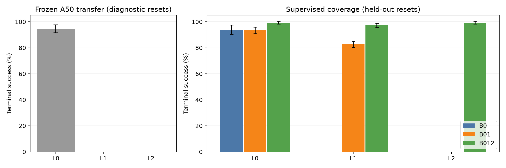
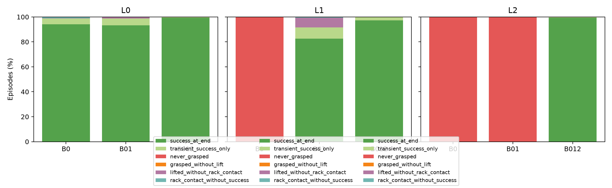
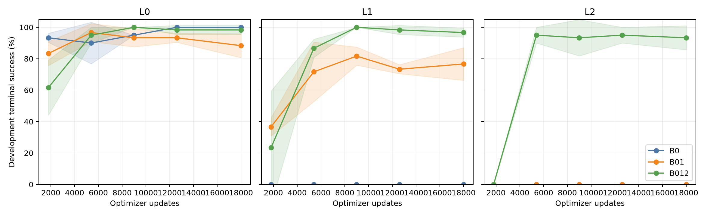

# PlaceMugRack：L0／L1／L2 数据覆盖实验结果

日期：2026-10-08。状态：九组训练及全部 **6,300 条主实验 rollout** 已完成，最终审计通过。

完成时间：**13:54:56 CST**。独立systemd用户服务正常结束，退出码0；控制器及实验进程已结束。

本轮沿用官方 ACT 和 human video 条件，比较单任务三个场景级别的数据覆盖；核心源码和上一轮脚本、A50 权重均保持一致。方案见 [09](09_PLACEMUGRACK_LEVEL_EXPERIMENT_PLAN.md)。

## 1. 冻结 A50 的直接迁移

保持三个 A50 selected checkpoint、human_H57 episode 1、L0 训练统计量不变，在每个级别用 seeds 3000–3099 测试 100 次。以下均为三个训练 seed 的均值 ± 样本标准差；这不是置信区间。

- **L0**：终端成功 94.67% ± 3.06 个百分点；曾成功 99.33% ± 1.15 个百分点。
- **L1**：终端成功 0.00% ± 0.00 个百分点；曾成功 0.00% ± 0.00 个百分点。
- **L2**：终端成功 0.00% ± 0.00 个百分点；曾成功 0.00% ± 0.00 个百分点。

[冻结迁移逐模型记录](../experiments/act_placemugrack_levels/phase_a/summary.json)。该部分与新训练的最终测试使用不同 reset 集及 checkpoint 选择协议，不直接作为配对训练增益。

## 2. 三组固定预算训练的独立最终测试

B0 使用 50 条 L0；B01 使用 L0/L1 各 50 条；B012 使用 L0/L1/L2 各 50 条。每组三个训练 seed，每个 run B64、18,000 次更新；数据级别均衡采样，ACT/Adapter 从头初始化。

### B0

- **L0**：终端成功 94.00% ± 3.61 个百分点（seed1/2/3：95/100, 90/100, 97/100）；曾成功 98.67% ± 0.58 个百分点。
- **L1**：终端成功 0.00% ± 0.00 个百分点（seed1/2/3：0/100, 0/100, 0/100）；曾成功 0.00% ± 0.00 个百分点。
- **L2**：终端成功 0.00% ± 0.00 个百分点（seed1/2/3：0/100, 0/100, 0/100）；曾成功 0.00% ± 0.00 个百分点。

三个级别等权终端成功均值：**31.33%**。

### B01

- **L0**：终端成功 93.33% ± 2.52 个百分点（seed1/2/3：91/100, 93/100, 96/100）；曾成功 98.67% ± 0.58 个百分点。
- **L1**：终端成功 82.67% ± 2.31 个百分点（seed1/2/3：84/100, 80/100, 84/100）；曾成功 91.67% ± 6.66 个百分点。
- **L2**：终端成功 0.00% ± 0.00 个百分点（seed1/2/3：0/100, 0/100, 0/100）；曾成功 0.00% ± 0.00 个百分点。

三个级别等权终端成功均值：**58.67%**。

### B012

- **L0**：终端成功 99.33% ± 1.15 个百分点（seed1/2/3：100/100, 100/100, 98/100）；曾成功 100.00% ± 0.00 个百分点。
- **L1**：终端成功 97.33% ± 1.53 个百分点（seed1/2/3：99/100, 97/100, 96/100）；曾成功 99.67% ± 0.58 个百分点。
- **L2**：终端成功 99.33% ± 1.15 个百分点（seed1/2/3：98/100, 100/100, 100/100）；曾成功 99.67% ± 0.58 个百分点。

三个级别等权终端成功均值：**98.67%**。

## 3. 配对增益与原有级别保持

### B01-B0

- L0：终端成功平均变化 **-0.67 个百分点**；配对 seed1/2/3：-4.0, +3.0, -1.0。
- L1：终端成功平均变化 **+82.67 个百分点**；配对 seed1/2/3：+84.0, +80.0, +84.0。
- L2：终端成功平均变化 **+0.00 个百分点**；配对 seed1/2/3：+0.0, +0.0, +0.0。

### B012-B01

- L0：终端成功平均变化 **+6.00 个百分点**；配对 seed1/2/3：+9.0, +7.0, +2.0。
- L1：终端成功平均变化 **+14.67 个百分点**；配对 seed1/2/3：+15.0, +17.0, +12.0。
- L2：终端成功平均变化 **+99.33 个百分点**；配对 seed1/2/3：+98.0, +100.0, +100.0。

### B012-B0

- L0：终端成功平均变化 **+5.33 个百分点**；配对 seed1/2/3：+5.0, +10.0, +1.0。
- L1：终端成功平均变化 **+97.33 个百分点**；配对 seed1/2/3：+99.0, +97.0, +96.0。
- L2：终端成功平均变化 **+99.33 个百分点**；配对 seed1/2/3：+98.0, +100.0, +100.0。

差值在相同训练 seed、同级别同 reset 初始状态下比较。100 条 rollout 不能替代多个独立训练模型，三个训练 seed 也不足以据此轻率宣称统计显著。

## 4. 失败阶段与动作尺度

阶段分类互斥，优先判断第500步成功，其次短暂成功，再按是否抓取、抬升、接触挂架定位。官方成功谓词为接触挂架、杯子超过高度阈值且当前未被夹持；终端成功不等于长期静止悬挂。

- **B0/L0**，300 条：success_at_end=282；transient_success_only=14；never_grasped=0；grasped_without_lift=0；lifted_without_rack_contact=1；rack_contact_without_success=3。两臂曾抓取次数：[300, 0]（可能同一条两臂都抓过）。
- **B0/L1**，300 条：success_at_end=0；transient_success_only=0；never_grasped=300；grasped_without_lift=0；lifted_without_rack_contact=0；rack_contact_without_success=0。两臂曾抓取次数：[0, 0]（可能同一条两臂都抓过）。
- **B0/L2**，300 条：success_at_end=0；transient_success_only=0；never_grasped=300；grasped_without_lift=0；lifted_without_rack_contact=0；rack_contact_without_success=0。两臂曾抓取次数：[0, 0]（可能同一条两臂都抓过）。
- **B01/L0**，300 条：success_at_end=280；transient_success_only=16；never_grasped=0；grasped_without_lift=0；lifted_without_rack_contact=4；rack_contact_without_success=0。两臂曾抓取次数：[300, 0]（可能同一条两臂都抓过）。
- **B01/L1**，300 条：success_at_end=248；transient_success_only=27；never_grasped=0；grasped_without_lift=0；lifted_without_rack_contact=23；rack_contact_without_success=2。两臂曾抓取次数：[300, 0]（可能同一条两臂都抓过）。
- **B01/L2**，300 条：success_at_end=0；transient_success_only=0；never_grasped=300；grasped_without_lift=0；lifted_without_rack_contact=0；rack_contact_without_success=0。两臂曾抓取次数：[0, 0]（可能同一条两臂都抓过）。
- **B012/L0**，300 条：success_at_end=298；transient_success_only=2；never_grasped=0；grasped_without_lift=0；lifted_without_rack_contact=0；rack_contact_without_success=0。两臂曾抓取次数：[300, 0]（可能同一条两臂都抓过）。
- **B012/L1**，300 条：success_at_end=292；transient_success_only=7；never_grasped=0；grasped_without_lift=0；lifted_without_rack_contact=0；rack_contact_without_success=1。两臂曾抓取次数：[300, 0]（可能同一条两臂都抓过）。
- **B012/L2**，300 条：success_at_end=298；transient_success_only=1；never_grasped=0；grasped_without_lift=0；lifted_without_rack_contact=1；rack_contact_without_success=0。两臂曾抓取次数：[0, 300]（可能同一条两臂都抓过）。

A50/B0 的第15维动作 q01=q99=1，反归一化后第二臂夹爪始终张开。B01 是否仍退化、B012 是否获得活动范围，以实际统计如下为准：

- B0：第二臂夹爪 q01/q99=1/1；零宽动作维=[15]。
- B01：第二臂夹爪 q01/q99=1/1；零宽动作维=[15]。
- B012：第二臂夹爪 q01/q99=-1/1；零宽动作维=[]。

每个模型跨 L0/L1/L2 只使用一套来自自身训练数据的共享 stats；三组之间 stats 不同。因此改善同时包含合法训练尺度覆盖和网络参数学习，不能只归因于视觉表征。部署截断比例、夹爪命令范围和两臂抓取逐 run/level 见 [results.json](../experiments/act_placemugrack_levels/results.json)。

## 5. 学习曲线、选择与结论边界

五个 checkpoint 在每个级别用 seeds 4000–4019、20次开发评估；按三个级别等权终端成功选择，平分时看曾成功，再取较早步数。九个选择全部冻结后，才使用 seeds 5000–5099 完成最终测试。

B0/B01 的未训练级别开发评分参与了 checkpoint 选择，所以最终测试不称为从未接触目标级别反馈的严格 zero-shot。完整冻结的 A50 迁移单独报告。

B012 测试的是训练已覆盖的官方替代物体、场景级别中的新 reset；未留出新的杯子模型、语义任务或真实机器人。50/100/150 条示范总量及各级别重复呈现次数也变化，主实验回答的是固定计算预算下整套监督覆盖方案的收益。

## 6. 正确性与资源

- 600个真实轨迹首尾样本核对，动作padding、标签来源、human配对和stats映射通过。
- 新评估包装器与旧包装器在相同四条轨迹上的动作、阶段和指标完全一致；训练更新与实际官方epoch源代码的参数更新完全一致。
- 正式九组共162,000次更新、10,368,000次样本呈现；45份checkpoint回读及hash通过；主实验900次冻结评估、2,700次开发、2,700次最终测试。中断run的额外18,000次更新、320次开发评估已归档，不计入上述主实验计数。
- 同级别同seed的场景、关节、RGB和机器人root pose配对检查通过；72段主录像均为501帧。
- 执行前修正了方案对镜像的描述：官方ACT入口保持机器人底座，L2仅镜像场景物体；首次原型断言失败归档，未计入主实验。
- telemetry记录GPU利用率均值 56.5%，显存峰值 20.08 GiB；采样自controller启动起，不覆盖最早的准备/部分阶段A。
- 从阶段A启动至报告生成约 **14.78小时**，包含准备阶段、夜间约8.9小时中断等待及重跑开销；09:28恢复独立后台服务后约 **4.45小时** 完成剩余训练、最终测试和审计。14.78小时不能解释为连续主动计算时长。详细吞吐和并发选择见 [calibration/results.json](../experiments/act_placemugrack_levels/calibration/results.json)。

10月8日上午发现旧控制器退出，B0_s1和B01_s1均停在9,000次更新。保留完整B012_s1，将两次中断run归档后从原seed重跑；14个冻结执行脚本、统计量及训练协议未变。中断原因未被原日志记录。GPU利用率均值只按实际telemetry样本计算，中断期间缺失记录未补零。详见[恢复记录](../experiments/act_placemugrack_levels/RECOVERY.md)。

完整审计：[final-audit.json](../experiments/act_placemugrack_levels/checks/final-audit.json)。权重索引：[final-test-selection.json](../experiments/act_placemugrack_levels/final-test-selection.json)。录像在每个 `runs/<run>/test/<level>/videos/`；失败补录若另行执行须单独标注。
