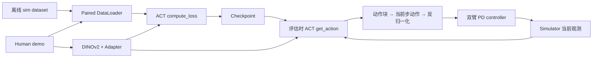

# Imitator 源码学习导航

更新日期：2026-10-10。源码目录：`/home/zxc/Imitator/The-Imitator-Game`。
核对 commit：`d6d16ec511bc389e0a207692730c137bc022ef14`。

本组文档围绕 **ACT＋冻结 DINOv2-L、human video 条件、双臂仿真、单路 zed2i RGB、qpos 控制** 展开，描述当前代码的实际行为。前三篇记录初次源码梳理；第四篇补充随后完成的真实任务训练、checkpoint 和评估结果。核心代码保持原样，未提出或实现新方法。

## 阅读顺序

1. [01_REPO_MAP.md](01_REPO_MAP.md)：定位训练入口、dataset、human demo encoder、ACT policy、simulator、evaluation 六个模块及连接它们的辅助文件。
2. [02_SAMPLE_TO_ACT.md](02_SAMPLE_TO_ACT.md)：从一条离线轨迹样本、配对人类视频、DataLoader batch，一直追到 ACT 的动作块，逐步标注 tensor shape。
3. [03_EVALUATION_TO_ROBOT.md](03_EVALUATION_TO_ROBOT.md)：追踪评估时的观测、动作聚合、反归一化、左右臂拆分、PD controller 和评分。
4. [04_ACT_SMOKE_RUN.md](04_ACT_SMOKE_RUN.md)：官方 PlaceMugRack 最小数据闭环实测；171 次更新、checkpoint 回读、2 个仿真 episode、录像和复跑命令。
5. [05_PLACEMUGRACK_TRAINING_PLAN.md](05_PLACEMUGRACK_TRAINING_PLAN.md)：前一版充分训练设计，保留作背景记录；执行排期由第六篇替代。
6. [06_4090_EXPERIMENT_DESIGN.md](06_4090_EXPERIMENT_DESIGN.md)：已执行的 4090 实验方案；10/50 条示范 × 3 个训练 seed、固定计算预算、吞吐标定和独立最终测试。
7. [07_PLACEMUGRACK_EXPERIMENT_RESULTS.md](07_PLACEMUGRACK_EXPERIMENT_RESULTS.md)：六组训练的最终成功率、稳定性、失败阶段、资源计时、图件及权重/视频索引。
8. [08_REAL_SAMPLE_WALKTHROUGH.md](08_REAL_SAMPLE_WALKTHROUGH.md)：使用真实训练数据和已有 checkpoint，通过七个交互暂停点查看配对、DINO 缓存、ACT 动作块和 CVAE 训练/推理区别。
9. [09_PLACEMUGRACK_LEVEL_EXPERIMENT_PLAN.md](09_PLACEMUGRACK_LEVEL_EXPERIMENT_PLAN.md)：已执行的 L0/L1/L2 数据覆盖实验；先冻结 A50 测跨级别，再做三组数据 × 三个训练 seed 的固定预算对照，记录动作尺度与左右臂限制。
10. [10_PLACEMUGRACK_LEVEL_EXPERIMENT_RESULTS.md](10_PLACEMUGRACK_LEVEL_EXPERIMENT_RESULTS.md)：跨级别实验最终报告；九组训练、6,300条主实验rollout和最终审计均已完成，包含独立测试结果、配对增益、学习曲线、失败阶段及中断恢复后的计时说明。
11. [11_ACT_DINOV2_15TASK_REPRODUCTION.md](11_ACT_DINOV2_15TASK_REPRODUCTION.md)：已完成的 ACT＋DINOv2 官方 15 任务仿真复现；共享模型、已见／未见评估与少样本对照，明确记录论文和代码参数差异、归一化信息边界、临时 Sub-SR 阈值及 L3 评估修正。
12. [12_ACT_DINOV2_15TASK_RESULTS.md](12_ACT_DINOV2_15TASK_RESULTS.md)：三个训练条件、800 次正式评估的最终结果与分析；包含少样本微调收益、失败阶段、论文对齐边界，以及 decoder 输出选层的源码和真实 batch 梯度证据。

训练和执行连接如下。训练 batch 中的 `robot_actions` 是监督标签；评估时送入模拟器的是策略预测的动作。



图中视频编码在冻结训练路径中可以预计算并缓存；具体缓存边界见第二篇。

## Shape 的依据与范围

- **前三篇的源码推导**：LeRobot 文件读取、归一化、缓存与仿真/controller 调用链。初次梳理时尚无本地 IG-10K 数据与任务资产，因此当时没有把这些部分表述成真实任务实测；后续实测证据另列在第四篇。
- **合成样本动态核查**：已运行真实 `HumanSimPairedDataset.__getitem__`、collate、`ACTAgent.compute_loss`、`prepare_for_eval` 和 `get_action`。底层解码后的 sim/human 样本是构造数据；DINOv2-L 与 ResNet18 使用本机已有预训练权重。没有优化器更新或 `env.step`。
- 核查采用 `B=1`、10 帧人类视频、10 帧编码、`hidden_dim=256`、4 层 decoder。文档同时给出一般 batch 大小的符号表达。
- 原始记录：[shape_trace.json](shape_trace.json)；日志：[shape_trace.log](shape_trace.log)；可复查脚本：[trace_act_shapes.py](trace_act_shapes.py)。
- **后续真实任务运行**：第四篇使用官方数据、物体资产和 ACT 入口完成训练与在线评估。训练 batch shape 与此前推导一致；实际任务成功率为 0/2，只用于确认流程可执行。

形状核查结果包含一个容易误读的实现细节：ACT Transformer 返回 `[4, 1, 24, 256]`，当前 `DETRVAE` 的 `[0]` 取的是第一个 decoder 层输出。这一行为同时经过源码和运行时 hook 确认，文档按现状记录。

## 可选复查

```bash
source /home/zxc/Imitator/scripts/activate_imitator.sh
python /home/zxc/Imitator/LearningDocs/trace_act_shapes.py
```

脚本使用已有模型缓存，将记录写回本目录。它不是训练命令，也不会启动 benchmark 任务。环境配置说明另见 [environment/README.md](../environment/README.md)。
